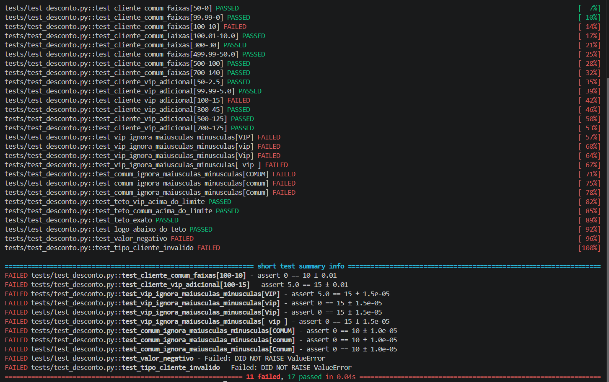
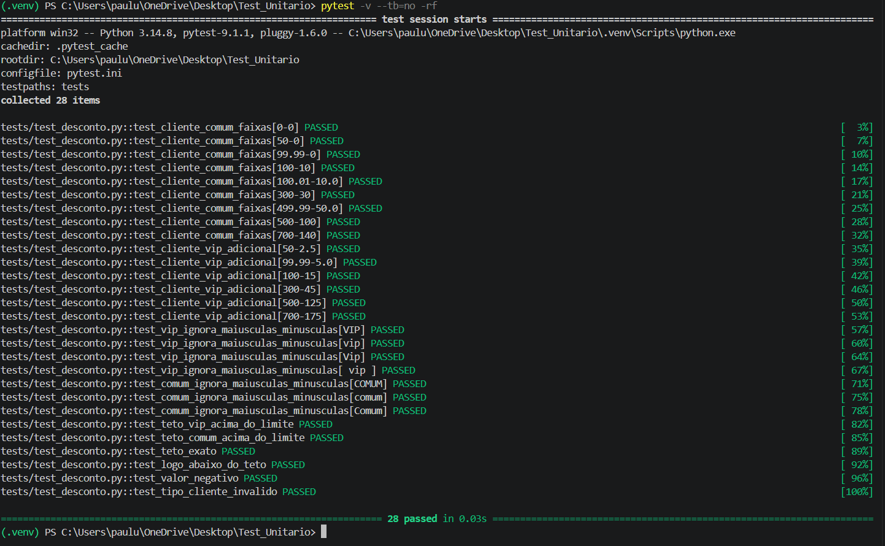

# Test_Unitario — QA da função `calcular_desconto`

Desafio prático: escrever testes automatizados para a User Story de descontos progressivos, encontrar os bugs do código do Dev Jr. e corrigi-los.

## Estrutura

```
src/tech/desconto.py            # código corrigido
src/tech/desconto_original.py   # código original do Dev Jr. (com bugs)
tests/test_desconto.py          # 28 testes (Pytest)
prints/                         # evidências (PRINT1 e PRINT2)
```

## Como rodar

```bash
python -m venv .venv
.venv\Scripts\Activate.ps1      # Windows (PowerShell)
pip install pytest
pytest -v
```

## Cenários de teste

| Cenário | Por que importa |
|---|---|
| R$ 0, 50 e 99,99 (COMUM) | Faixa de 0% e seu limite superior |
| R$ 100 e 100,01 | **Limite:** exatamente 100 deve dar 10% |
| R$ 300 | O "teste de cabeça" do Dev Jr. |
| R$ 499,99 e 500 | **Limite:** exatamente 500 deve dar 20% |
| VIP em todas as faixas | Soma de 5% (0→5, 10→15, 20→25) |
| `"VIP"`, `"vip"`, `"Vip"`, `" vip "` | Case-insensitive e espaços |
| R$ 1000 VIP e R$ 2000 COMUM | Teto de R$ 200 |
| R$ 1000 COMUM | Desconto de exatamente R$ 200 |
| R$ 799,99 VIP e R$ 999,99 COMUM | Logo abaixo do teto |
| Valor negativo e tipo inválido | Entradas inválidas (boa prática) |

## Bugs encontrados no código do Dev Jr.

1. **Limite de R$ 100:** usava `valor_compra > 100`; o critério pede "igual ou maior" (`>= 100`). Compra de exatamente R$ 100 recebia 0% em vez de 10%.
2. **VIP case-sensitive:** `tipo_cliente == "VIP"` ignorava `"vip"` e `"Vip"`. Corrigido com `.strip().upper()`.
3. **Sem validação de entrada:** aceitava valor negativo e tipo de cliente desconhecido. Agora lança `ValueError`.

O teste de cabeça (R$ 300) passou porque caiu no meio de uma faixa e não tocou em nenhum limite, em nenhum VIP em minúsculo e no teto.

## Evidências

**PRINT1 — código original (11 falharam, 17 passaram):**



**PRINT2 — código corrigido (28 passaram):**


